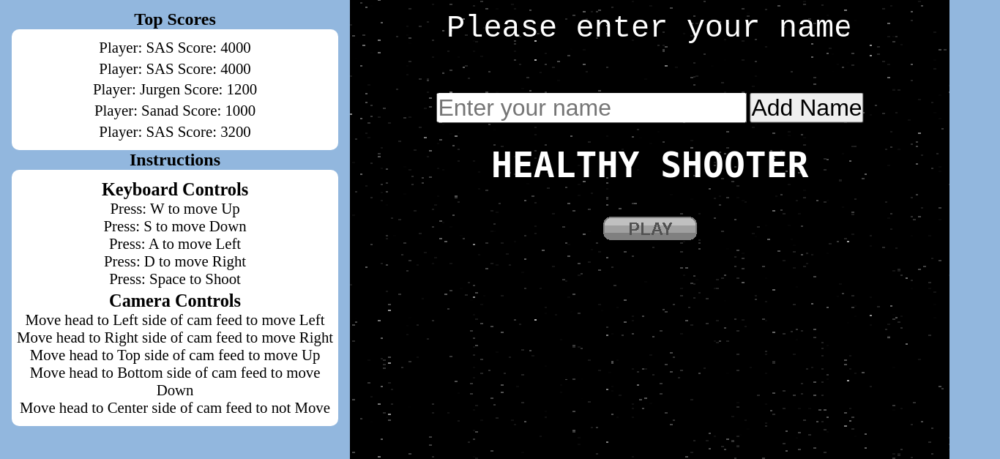

<!-- PROJECT LOGO -->
# Project Healthy Shooter Video Game


<!-- TABLE OF CONTENTS -->
## Table of Contents

* [About the Project](#about-the-project)
  * [Built With](#built-with)
* [Getting Started](#getting-started)
  * [Prerequisites](#prerequisites)
  * [Installation](#installation)
* [How to play](#How-to-play)
* [Contributing](#contributing)
* [License](#license)
* [Contact](#contact)
* [Acknowledgements](#acknowledgements)

<br>



<br>

## Live Demo

[Live Demo](https://agitated-curran-7c280e.netlify.app/)

<br>

<!-- ABOUT THE PROJECT -->
## About The Project


A Shooter Game called Healthy Shooter, the idea of this game is to incorporate physical activity into video games. For this the web cam is used where the position of the user is used to determine the position of the player character. Thus achieveing physical activity during gameplay.


### Built With

* JavaScript
* Phaser Game Engine
* Webpack
* ML5


<!-- GETTING STARTED -->
## Getting Started

To get a local copy up and running follow these simple example steps.

### Prerequisites

This is an example of how to list things you need to use the software and how to install them.
* npm
```sh
npm install npm@latest -g
```

### Installation

1. Get a free API Key at [https://www.notion.so/Leaderboard-API-service-24c0c3c116974ac49488d4eb0267ade3](https://www.notion.so/Leaderboard-API-service-24c0c3c116974ac49488d4eb0267ade3)
2. Clone the repo
```sh
git clone https://github.com/jurgen1c/healthy-shooter.git
```
3. Install NPM packages
```sh
npm install
```
4. Enter your API in `api.js`
```JS
const key = 'Enter Your API';
```
5. Run Webpack dev-server
```sh
npm run start
```
6. Run the Tests:
```sh
npm run test
```

## How to play

* Use A, S, D, W to move
* Use Spacebar to fire
* Move head to webcam feed cuadrants to move with cam controls
* Destroy enemies to gain score


<!-- CONTRIBUTING -->
## Contributing

Contributions are what make the open source community such an amazing place to be learn, inspire, and create. Any contributions you make are **greatly appreciated**.

1. Fork the Project
2. Create your Feature Branch (`git checkout -b feature/AmazingFeature`)
3. Commit your Changes (`git commit -m 'Add some AmazingFeature'`)
4. Push to the Branch (`git push origin feature/AmazingFeature`)
5. Open a Pull Request


<!-- LICENSE -->
## License

Distributed under the MIT License. See `LICENSE` for more information.


<!-- CONTACT -->
## Author

👤 **Jurgen Clausen**

- Github: [@jurgen1c](https://github.com/jurgen1c)
- LinkedIn: [jurgen-clausen](https://www.linkedin.com/in/jurgen-clausen-2740061a9/)
- Portafolio: [Personal-portafolio](https://jurgen1c.github.io/Portafolio/)

<br>


<!-- ACKNOWLEDGEMENTS -->
Give a ⭐️ if you like this project!

## Acknowledgments

- Microverse
- GitHub
- The-Thanatos Team


<!-- MARKDOWN LINKS & IMAGES -->
<!-- https://www.markdownguide.org/basic-syntax/#reference-style-links -->
[contributors-shield]: https://img.shields.io/github/contributors/othneildrew/Best-README-Template.svg?style=flat-square
[contributors-url]: https://github.com/othneildrew/Best-README-Template/graphs/contributors
[forks-shield]: https://img.shields.io/github/forks/othneildrew/Best-README-Template.svg?style=flat-square
[forks-url]: https://github.com/othneildrew/Best-README-Template/network/members
[stars-shield]: https://img.shields.io/github/stars/othneildrew/Best-README-Template.svg?style=flat-square
[stars-url]: https://github.com/othneildrew/Best-README-Template/stargazers
[issues-shield]: https://img.shields.io/github/issues/othneildrew/Best-README-Template.svg?style=flat-square
[issues-url]: https://github.com/othneildrew/Best-README-Template/issues
[license-shield]: https://img.shields.io/github/license/othneildrew/Best-README-Template.svg?style=flat-square
[license-url]: https://github.com/othneildrew/Best-README-Template/blob/master/LICENSE.txt
[linkedin-shield]: https://img.shields.io/badge/-LinkedIn-black.svg?style=flat-square&logo=linkedin&colorB=555
[linkedin-url]: https://linkedin.com/in/othneildrew
[product-screenshot]: images/screenshot.png
